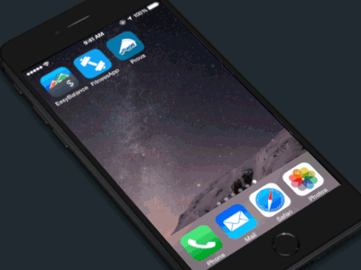
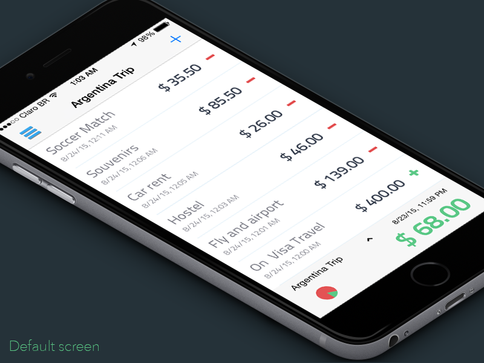
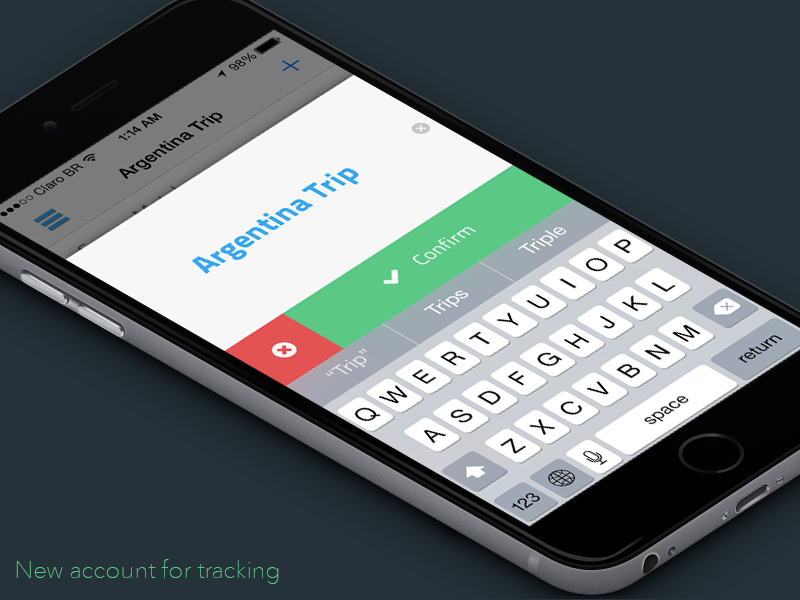
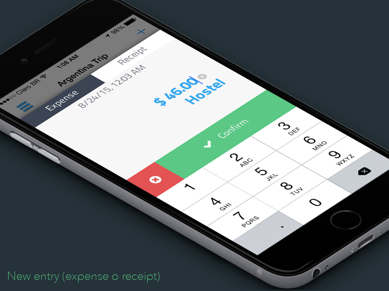
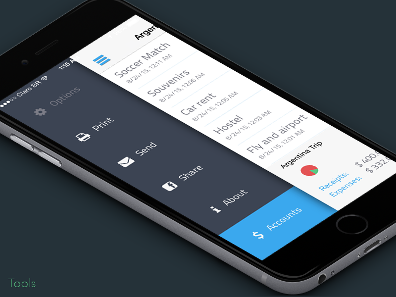
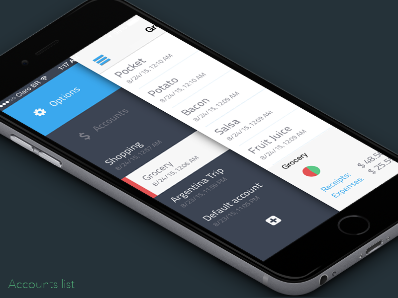

#Easy Balance

Full app open source now. To get it on AppleStore:
[Easy Balance](https://itunes.apple.com/br/app/easy-balance/id393762832?l=en&mt=8)

by Daniel Bonates, Designer & Developer - 2013

Do you you know how much do you have in your pocket? Now you can do it easy ;)

##TODO:
- Oriental Keyboard fix (right->left type direction)
- iCloud Support
- Password
- Access on today's notification (for easy access for transactions). 
- Quick Pay (-) and Draw (+). 
- Apple Watch Support
